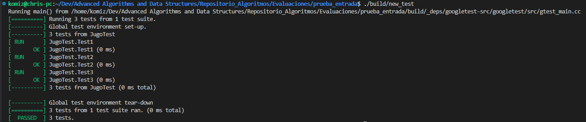

# Prueba de Entrada Algoritmos y Estructuras de datos avanzados

## Problema 1

Este programa define una clase Jugo y una función maxValorRetirado que evalúa el máximo número de elementos (pesos) que se pueden seleccionar de una lista, bajo ciertas restricciones.

Tenemos la lista de pesos que son la fracción de cada jugo que quieren en su bebida, donde solo les gustará la bebida si la fracción de cada uno de los 3 jugos en la mezcla es mayor o igual a su fracción mínima para ese jugo.

Para determinar el número máximo de personas a satisfacer realizamos el problema de la mochila, siendo las personas los "items" a agregar, y la función a maximizar la cantidad de personas, las restricciones serían las fracciones de cada jugo y el peso la suma de los 3 jugos utilizados.

La implementación se realiza de la siguiente manera, dado que es knapsack 0-1 sin memoización ni DP, tenemos una complejidad de O(2^n), siendo n el número de personas.

```cpp
int maxValorRetirado(Jugo W, int j, const std::vector<std::vector<int>>& pesos) {
    if (W.sum() > 10000) return INT_MIN;
    if (j >= pesos.size()) return 0;

    const std::vector<int>& peso_j = pesos[j];
    Jugo newPeso = W;
    if (peso_j[0] > newPeso.A) newPeso.A = peso_j[0];
    if (peso_j[1] > newPeso.B) newPeso.B = peso_j[1];
    if (peso_j[2] > newPeso.C) newPeso.C = peso_j[2];

    return std::max(
        1 + maxValorRetirado(newPeso, j + 1, pesos),
        maxValorRetirado(W, j + 1, pesos)
    );
}
```

Las condiciones iniciales son 1<=T<=2 y 1<=N<=5000

No se optó por usar memoización ni DP debido a la complejidad pseudopolinómica que poseemos y que al tener un peso máximo de 10^4 tendríamos una matriz del tamaño 


Definimos las pruebas para el problema 1 utilizando gtest,


